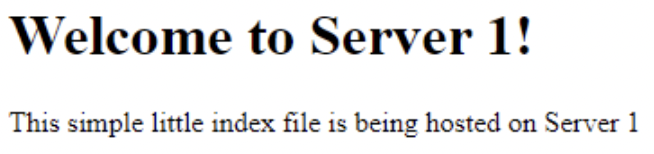
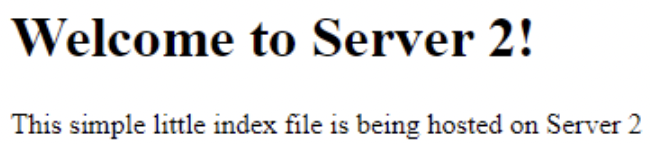

## Part 2 - Setup Load Balancing TODOs

1. Create an `/etc/hosts` OR `.ssh/config` file on each system that correlates hostnames to private IPs.
   - In this screenshot, I add private IPs to the /etc/hosts file.  
        
        
2. Document how to SSH in between the systems utilizing their private IPs.
```
web serv1: ssh -i /home/ubuntu/.ssh/colin.pem ubuntu@10.0.1.10
web serv2: ssh -i /home/ubuntu/.ssh/colin.pem ubuntu@10.0.1.11
```

3. **_HAProxy configuration & documentation requirements_**
   - How to set up a HAProxy load balancer
     - What file(s) where modified & their location
         * File: haproxy.cfg
         * Location: /etc/haproxy/
     - What configuration(s) were set (if any)
     ```
        frontend 98.97.8.100
           bind 10.0.0.10:80
           default_backend web_servers
           bind *:8404
           stats enable
           stats uri /stats
           stats refresh 10s
           stats admin if LOCALHOST

         backend web_servers
           balance roundrobin
           option httpchk HEAD /
           server webserv1 10.0.1.10:80
           server webserv2 10.0.1.11:80
     ```
     - How to restart the service after a configuration change
         * sudo systemctl restart haproxy
     - Resources used (websites)
         * https://www.haproxy.com/blog/the-four-essential-sections-of-an-haproxy-configuration/

4. **_Webserver 1 & 2 configuration & documentation requirements_**
   - How set up a webserver
     - What file(s) were modified & their location
         * File: index.html
         * Location: /var/www/html
     - What configuration(s) were set (if any)
         * No configurations were used.
     - Where site content files were located (and why)
         * Site content files were located in the /var/www/html file on the instance.
         * This allows you to output the index.html file and switch servers.
     - How to restart the service after a configuration change
         * sudo systemctl restart apache2
     - Resources used (websites)
         * https://ubuntu.com/server/docs/web-servers-apache
     
5. From the browser, when connecting to the proxy server, take two screenshots.
   - Screenshot that shows content from "server 1".  
   
   
   - Screenshot that shows content from "server 2".  
   
